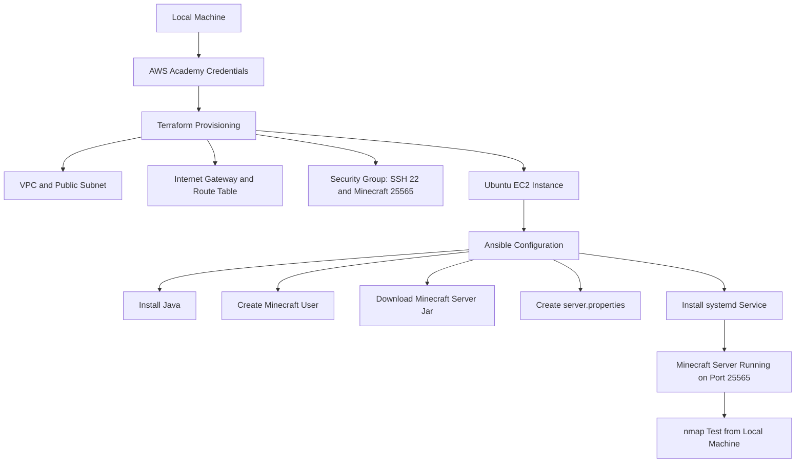

# Automated Minecraft Server Deployment on AWS

## Background

This project automates the deployment of a Minecraft server on AWS for CS312 Course Project Part 2. In Part 1, the Minecraft server was installed manually on an EC2 instance. In Part 2, the goal is to improve that process by using Infrastructure as Code and configuration automation.

This repository uses Terraform to provision AWS infrastructure and Ansible to configure the Minecraft server. The deployment can be run from a local machine without manually logging in to the AWS Management Console or manually SSHing into the instance.

The final server runs on an Ubuntu EC2 instance and listens on Minecraft port `25565`. The server is configured as a `systemd` service so it automatically starts when the EC2 instance boots or reboots.

## Architecture / Pipeline Overview



## Requirements

The following tools must be installed on the local machine before running the project:

* Git
* AWS CLI
* Terraform
* Ansible
* nmap
* SSH key generation tools

The project was tested on macOS using Homebrew-installed versions of these tools.

Useful version check commands:

```bash
git --version
aws --version
terraform -version
ansible --version
nmap --version
```

## AWS Credentials Setup

This project uses temporary AWS Academy Learner Lab credentials.

In AWS Academy Learner Lab:

1. Start the lab.
2. Open **AWS Details**.
3. Copy the AWS CLI credentials.
4. Paste the credentials into `~/.aws/credentials`.

Example `~/.aws/credentials` format:

```ini
[default]
aws_access_key_id=YOUR_ACCESS_KEY
aws_secret_access_key=YOUR_SECRET_KEY
aws_session_token=YOUR_SESSION_TOKEN
```

Create or edit `~/.aws/config`:

```ini
[default]
region=us-east-1
output=json
```

Verify AWS CLI access:

```bash
aws sts get-caller-identity
```

If this command returns AWS account information, the AWS CLI is configured correctly.

## Repository Structure

```text
minecraft-iac-project/
├── README.md
├── .gitignore
├── ansible/
│   ├── inventory.ini
│   ├── playbook.yaml
│   └── templates/
│       └── minecraft.service.j2
├── scripts/
│   ├── 01_provision.sh
│   ├── 02_configure.sh
│   ├── 03_test.sh
│   └── 04_destroy.sh
└── terraform/
    ├── main.tf
    ├── outputs.tf
    ├── variables.tf
    ├── terraform.tfvars.example
    └── terraform.tfvars
```

## What Terraform Creates

Terraform provisions the AWS infrastructure needed for the Minecraft server:

* VPC
* Public subnet
* Internet gateway
* Route table
* Route table association
* Security group
* EC2 key pair
* Ubuntu EC2 instance

The security group allows:

* SSH on port `22` for Ansible configuration
* Minecraft traffic on port `25565`
* Outbound traffic from the instance

## What Ansible Configures

Ansible configures the EC2 instance after Terraform creates it.

The Ansible playbook does the following:

* Updates the apt package cache
* Installs Java, wget, and curl
* Creates a dedicated `minecraft` system user
* Creates `/opt/minecraft`
* Downloads the Minecraft server `.jar`
* Accepts the Minecraft EULA
* Creates `server.properties`
* Installs a `systemd` service
* Enables and starts the Minecraft service

## Minecraft systemd Service

The Minecraft server is managed by `systemd`.

The service file is located at:

```text
ansible/templates/minecraft.service.j2
```

The service uses:

```ini
ExecStart=/usr/bin/java -Xms1G -Xmx2G -jar server.jar nogui
ExecStop=/bin/kill -SIGINT $MAINPID
Restart=on-failure
RestartSec=10
```

This allows the server to start automatically when the instance boots and stop more cleanly when the service is stopped.

## Commands to Run

Run all commands from the root of the repository.

### 1. Provision AWS Infrastructure

```bash
./scripts/01_provision.sh
```

This script runs Terraform and creates the AWS resources. It also writes the public IP address into the Ansible inventory file.

### 2. Configure the Minecraft Server

```bash
./scripts/02_configure.sh
```

This script runs the Ansible playbook and installs/configures the Minecraft server on the EC2 instance.

### 3. Test the Minecraft Server

```bash
./scripts/03_test.sh
```

This runs:

```bash
nmap -sV -Pn -p T:25565 <instance_public_ip>
```

A successful result should show port `25565/tcp` as open and identify the service as Minecraft.

Example successful output:

```text
25565/tcp open  minecraft Minecraft 1.21.5
```

## Connecting to the Server

After provisioning and configuration are complete, the Minecraft server is available at the EC2 instance public IP address on port `25565`.

The public IP can be displayed with:

```bash
cd terraform
terraform output instance_public_ip
cd ..
```

The server can be tested with:

```bash
./scripts/03_test.sh
```

## Reboot / Auto-start Verification

To verify that the Minecraft server starts automatically after rebooting the EC2 instance, use the AWS CLI.

Get the EC2 instance ID from Terraform state:

```bash
INSTANCE_ID=$(cd terraform && terraform state show aws_instance.minecraft_server | grep '^    id' | awk '{print $3}' | tr -d '"')
echo $INSTANCE_ID
```

Reboot the instance:

```bash
aws ec2 reboot-instances --instance-ids "$INSTANCE_ID"
```

Wait one to two minutes, then test the Minecraft port again:

```bash
./scripts/03_test.sh
```

If port `25565/tcp` is still open after reboot, the Minecraft service is successfully auto-starting.

## Cleanup

The assignment instructions say not to delete the instance before grading. Only run the destroy script after the project has been graded or if cleanup is allowed.

To destroy the AWS resources:

```bash
./scripts/04_destroy.sh
```

## Final Demo Recording Plan

For the final recording, do not use the AWS Management Console and do not manually SSH into the instance.

Show the following from the terminal:

```bash
git status
tree .
aws sts get-caller-identity
./scripts/01_provision.sh
./scripts/02_configure.sh
./scripts/03_test.sh
```

Then show reboot verification:

```bash
INSTANCE_ID=$(cd terraform && terraform state show aws_instance.minecraft_server | grep '^    id' | awk '{print $3}' | tr -d '"')
echo $INSTANCE_ID
aws ec2 reboot-instances --instance-ids "$INSTANCE_ID"
```

After waiting one to two minutes:

```bash
./scripts/03_test.sh
```

The important proof is that `nmap` shows port `25565/tcp` open before and after reboot.

## Resources Used

* Terraform AWS Provider documentation: https://registry.terraform.io/providers/hashicorp/aws/latest/docs
* AWS CLI documentation: https://docs.aws.amazon.com/cli/
* Ansible documentation: https://docs.ansible.com/
* Minecraft server download page: https://www.minecraft.net/en-us/download/server
* systemd service documentation: https://www.freedesktop.org/software/systemd/man/latest/systemd.service.html
* nmap documentation: https://nmap.org/book/man.html
