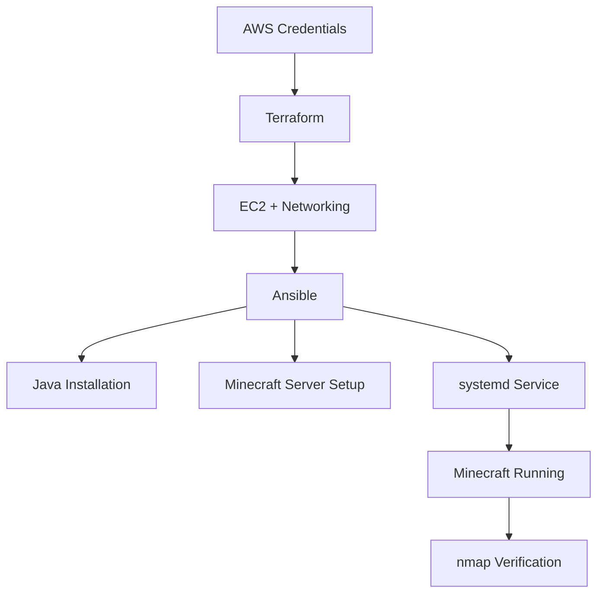

# Automated Minecraft Server Deployment on AWS

## Background

This project automates the deployment of a Minecraft server on AWS using Terraform and Ansible.

Terraform provisions the AWS infrastructure, including networking, security groups, and an Ubuntu EC2 instance. Ansible configures the server by installing Java, downloading the Minecraft server, creating a systemd service, and starting the server automatically.

The Minecraft server listens on port `25565` and is configured to start automatically after an EC2 reboot.

---

## Requirements

Install the following tools:

* Git
* AWS CLI
* Terraform
* Ansible
* nmap

Configure AWS Academy credentials:

```bash
aws sts get-caller-identity
```

This command should return your AWS account information.

---

## Pipeline Overview



---

## Repository Structure

```text
minecraft-iac-project/
├── terraform/
├── ansible/
├── scripts/
└── README.md
```

---

## Commands

### Provision Infrastructure

```bash
./scripts/01_provision.sh
```

Creates the AWS resources and generates the Ansible inventory.

### Configure Minecraft

```bash
./scripts/02_configure.sh
```

Installs and configures the Minecraft server.

### Test Minecraft

```bash
./scripts/03_test.sh
```

Runs:

```bash
nmap -sV -Pn -p T:25565 <public-ip>
```

Expected result:

```text
25565/tcp open minecraft
```

---

## Auto-Start Verification

Get the instance ID:

```bash
INSTANCE_ID=$(cd terraform && terraform state show aws_instance.minecraft_server | grep '^    id' | awk '{print $3}' | tr -d '"')
```

Reboot the instance:

```bash
aws ec2 reboot-instances --instance-ids "$INSTANCE_ID"
```

After waiting about two minutes:

```bash
./scripts/03_test.sh
```

If port `25565/tcp` is open after the reboot, the Minecraft service restarted successfully.

---

## Cleanup

Do not destroy resources until grading is complete.

When cleanup is allowed:

```bash
./scripts/04_destroy.sh
```

---

## Resources

* Terraform AWS Provider Documentation
* AWS CLI Documentation
* Ansible Documentation
* Minecraft Server Download Page
* nmap Documentation
